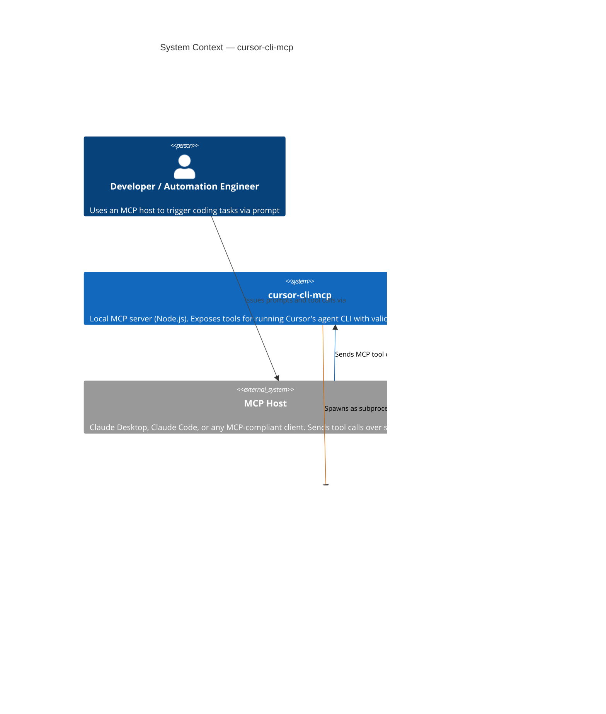
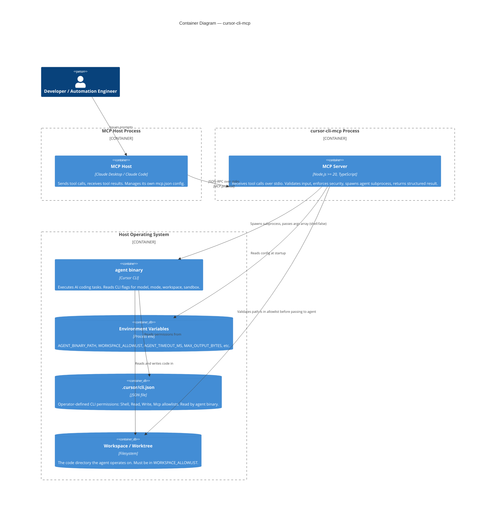
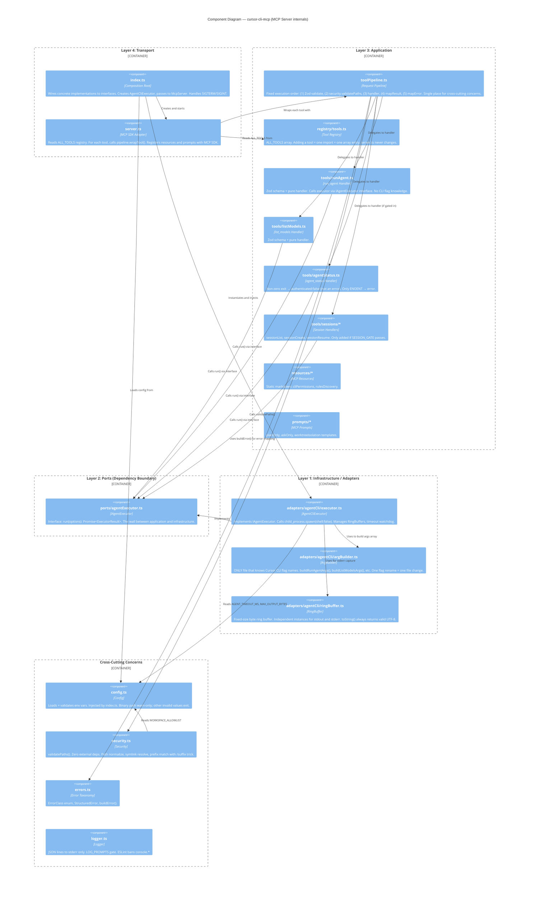

# Architecture Diagrams: cursor-cli-mcp

**Last updated:** 2026-04-21  
**Format:** C4 model — Context → Container → Component  
**Rendered:** GitHub renders Mermaid blocks natively.

---

## C4 Level 1 — System Context

> Who uses the system and what external systems does it talk to?



---

## C4 Level 2 — Container

> What are the deployable units and how do they interact?



---

## C4 Level 3 — Component

> What are the internal components of the MCP server and how do they connect?



---

## Dependency Flow (Simplified Arrow View)

```
┌─────────────────────────────────────────────────────────────────────┐
│  How data flows through the system for a run_agent call             │
└─────────────────────────────────────────────────────────────────────┘

  [MCP Host]
      │  tools/call { name: "run_agent", arguments: {...} }
      ▼
  [server.ts]  ──reads──▶  [registry/tools.ts]
      │  wrapTool(runAgentDescriptor)
      ▼
  [toolPipeline.ts]
      │
      ├─①─▶  [schema.parse()]           ──✗──▶  VALIDATION error → MCP Host
      │
      ├─②─▶  [security.validatePaths()] ──✗──▶  SECURITY error → MCP Host
      │
      ├─③─▶  [runAgent.handler()]
      │            │
      │            ▼
      │       [IAgentExecutor.run()]    ◀── interface boundary ──
      │            │                                              │
      │            ▼                                    [AgentCliExecutor]
      │       [argBuilder.buildRunAgentArgs()]                   │
      │            │                                             │
      │            ▼                                             │
      │       [child_process.spawn(binary, args, {shell:false})] │
      │            │                                             │
      │       [RingBuffer stdout]  [RingBuffer stderr]           │
      │            │                                             │
      │            ▼                                             │
      │       [ExecutorResult] ──────────────────────────────────┘
      │
      ├─④─▶  exitCode 0   → mapResult()  → McpToolResult (success)
      └─⑤─▶  exitCode ≠ 0 → classifyError() → McpToolResult (isError: true)

      ▼
  [MCP Host receives tools/call response]
```

---

## What Changes When...

| Scenario | Files that change | Files that don't change |
|----------|-----------------|------------------------|
| Add a new tool | `tools/newTool.ts` (new), `registry/tools.ts` (+1 line) | server.ts, pipeline, all other tools, executor |
| Cursor renames `--mode` flag | `adapters/agentCli/argBuilder.ts` (+1 function update) | All tool handlers, pipeline, server |
| Add rate limiting to all tools | `pipeline/toolPipeline.ts` (+1 step) | All tool handlers, executor, server |
| Swap subprocess for HTTP API | `adapters/httpAgent/executor.ts` (new), `index.ts` (swap import) | All tool handlers, pipeline, server, registry |
| Add a new MCP resource | `resources/newResource.ts` (new), `registry/resources.ts` (+1 line) | server.ts, tools, executor |
| Change config validation | `config.ts` | All tool handlers, executor interface |
| Add request tracing | `pipeline/toolPipeline.ts`, `logger.ts` | All tool handlers |

---

## Layer Violation Detection

ESLint import rules enforce these boundaries. Any import that crosses a forbidden boundary fails CI:

```
tools/* ──────────────────────── MAY import ──────────→ ports/*
tools/* ──────────────────────── MAY import ──────────→ errors.ts, logger.ts
tools/* ──────────────────────── FORBIDDEN ───────────✗ adapters/*
tools/* ──────────────────────── FORBIDDEN ───────────✗ other tools/*

adapters/* ───────────────────── MAY import ──────────→ ports/*
adapters/* ───────────────────── MAY import ──────────→ errors.ts, logger.ts, config.ts
adapters/* ───────────────────── FORBIDDEN ───────────✗ tools/*
adapters/* ───────────────────── FORBIDDEN ───────────✗ server.ts

ports/* ──────────────────────── FORBIDDEN ───────────✗ everything

security.ts ──────────────────── MAY import ──────────→ Node builtins only (path, fs)
security.ts ──────────────────── FORBIDDEN ───────────✗ everything else

logger.ts ────────────────────── FORBIDDEN ───────────✗ everything (writes stderr, no imports)
```
